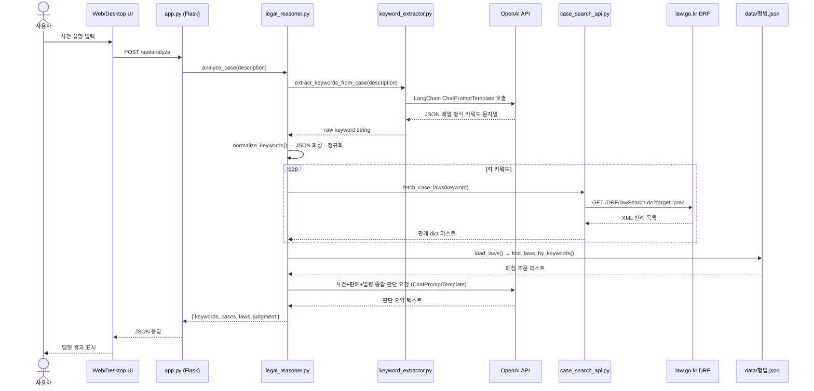

# Langlaw — 아키텍처 문서

---

## 개요

Langlaw는 크게 세 개의 레이어로 구성됩니다.

| 레이어 | 구성 요소 | 역할 |
|---|---|---|
| 프레젠테이션 | Web UI (Flask + HTML/JS), Desktop UI (Tkinter) | 사용자 입력 수신 · 결과 표시 |
| 애플리케이션 | `legal_reasoner.py` | 분석 파이프라인 조율 |
| 외부 서비스 | OpenAI API, law.go.kr DRF API | LLM 추론 · 판례 데이터 |

---

## 전체 데이터 흐름



---

## 컴포넌트 상세

### `app.py` — Flask 서버

진입점이자 HTTP 레이어입니다. 세 개의 라우트를 제공합니다.

| 라우트 | 메서드 | 역할 |
|---|---|---|
| `/` | GET | `templates/index.html` 렌더링 |
| `/api/settings` | GET | 키 설정 여부 반환 (값 미노출) |
| `/api/settings` | POST | `.env` 키 저장 · `os.environ` 즉시 반영 |
| `/api/analyze` | POST | `analyze_case()` 호출 후 결과 직렬화 |

시작 시 `.env`를 `load_dotenv()`로 로드하며, 설정 POST 이후에는 `override=True`로 재로드하여 서버 재시작 없이 새 키가 적용됩니다.

---

### `src/legal_reasoner.py` — 분석 파이프라인

`analyze_case(description: str) → dict` 함수가 전체 파이프라인을 순서대로 실행합니다.

```
analyze_case
 ├─ 1. extract_keywords_from_case()   → raw string
 ├─ 2. normalize_keywords()           → list[str]
 ├─ 3. fetch_case_laws() per keyword  → list[dict]
 ├─ 4. load_laws() + find_laws_by_keywords()  → list[dict]
 └─ 5. ChatPromptTemplate | ChatOpenAI → judgment string
```

`normalize_keywords()`는 LLM 응답이 markdown 코드 펜스(`\`\`\`json`)나 일반 문자열로 오는 경우를 모두 처리합니다.

반환 구조:

```python
{
    "case_description": str,
    "keywords_raw":     str,        # LLM 원본 응답
    "keywords":         list[str],  # 정규화된 키워드
    "cases":            list[dict], # 판례 (사건명, 사건번호, 선고일자, 법원명, 링크)
    "laws":             list[dict], # 조문 (조문번호, 제목, 내용)
    "judgment":         str,        # GPT 판단 요약
}
```

---

### `src/keyword_extractor.py` — 키워드 추출

LangChain `ChatPromptTemplate`과 `ChatOpenAI`를 파이프(`|`)로 연결한 단일 체인입니다.

- 시스템 프롬프트: "법률 사건 분석을 위한 키워드 추출 전문가"
- 사용자 프롬프트: 사건 설명 삽입 → JSON 배열 요청
- 반환: `response.content` (문자열) — `normalize_keywords()`가 후처리

---

### `src/case_search_api.py` — 판례 검색

law.go.kr DRF API의 `lawSearch.do` 엔드포인트를 호출합니다.

| 파라미터 | 값 |
|---|---|
| `target` | `prec` (판례) |
| `type` | `XML` |
| `query` | 키워드 |
| `display` | 키워드당 최대 결과 수 |

XML 응답을 `xml.etree.ElementTree`로 파싱해 dict 리스트로 반환합니다. `사건명` 필드가 없는 경우 `판례명`으로 폴백합니다.

---

### `src/law_api_downloader.py` — 형법 데이터 준비 (1회성)

```
get_law_id_by_name("형법")  →  법령 ID
    ↓
download_law_by_id(id)      →  data/형법.xml
    ↓
convert_xml_to_json()       →  data/형법.json
```

JSON 스키마:

```json
[
  { "조문번호": "제268조", "제목": "업무상과실·중과실 치사상", "내용": "..." },
  ...
]
```

런타임에는 `형법.json`만 사용하므로, 한번 생성 후에는 다시 실행할 필요가 없습니다.

---

### `templates/index.html` — 웹 프론트엔드

순수 HTML/CSS/JS SPA입니다. 외부 의존성이 없습니다.

| 영역 | 설명 |
|---|---|
| 헤더 | 로고 · "⚙ API 키 설정" 버튼 (키 미설정 시 빨간 점 표시) |
| 설정 모달 | `OPENAI_API_KEY` · `OC_ID` 입력, 보기/숨기기 토글 |
| 입력 카드 | 사건 설명 텍스트에어리어, Cmd/Ctrl+Enter 단축키 지원 |
| 결과 탭 | 키워드 칩 · 판례 카드 · 법령 조문 · 판단 요약 |

API 호출은 `fetch`를 통해 비동기로 실행되며, 분석 중 버튼 비활성화 및 스피너가 표시됩니다.

---

### `src/langlaw_gui.py` — Tkinter 데스크탑 UI

웹 UI와 동일한 `analyze_case()` 함수를 사용하며, `threading.Thread`로 백그라운드 실행해 UI 블로킹을 방지합니다.

```
MainWindow (Tk)
 ├─ ScrolledText (입력)
 ├─ Button "분석 실행"  →  background thread → analyze_case()
 └─ ResultsWindow (Toplevel)
      └─ Notebook (ttk)
           ├─ Tab: 키워드
           ├─ Tab: 판례
           ├─ Tab: 법령
           └─ Tab: 판단 요약
```

---

## 외부 의존성

| 패키지 | 용도 |
|---|---|
| `langchain-openai` | OpenAI 모델 래퍼 |
| `langchain-core` | 프롬프트 템플릿 · 체인 |
| `python-dotenv` | `.env` 읽기 · 쓰기 |
| `requests` | law.go.kr HTTP 호출 |
| `flask` | 웹 서버 |
| `tkinter` | 데스크탑 UI (Python 표준 라이브러리) |

---

## 보안 고려사항

- `/api/settings GET`은 키 존재 여부(`bool`)만 반환하며 실제 값은 노출하지 않습니다.
- `.env` 파일은 `.gitignore`에 포함되어 있어 커밋되지 않습니다.
- 이 앱은 로컬 또는 신뢰된 환경에서 실행하는 것을 전제로 합니다. 공개 인터넷에 배포할 경우 인증 레이어를 추가해야 합니다.
